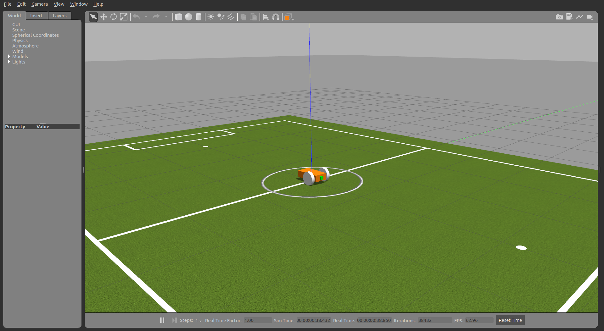

# GazeVehicle
use eye gaze to control the movements of a vehicle in ros

<div align=center></div>

### What's in this repo?
- [x] A robot with camera sensor
- [x] Face detection and analysis
- [x] Eye gaze estimation
- [x] Mouth status estimation
- [x] Control signal rendering to the robot


### Preparation
- install ROS and gazebo
- install tensorflow-gpu==1.14.0 (cuda-10.0, cudnn-7.4)
- install python libs: `dlib`, `scipy`
- Download the eye gaze [models](https://www.dropbox.com/sh/h23x33stlrhqvqq/AADn4iK7NMIc8bVnOkBpBBMSa?dl=0) and extract it to $ROOT_REPO


### Compile
```
cd $ROOT_REPO
catkin_make
```

### Launch
```
source devel/setup.bash
roslaunch launch/one_of_the_files.launch
```

### Demo

1. Show robot in gazebo simulator
<div align=center></div>


2. Show image obtained by the camera on the robot

<div align=center></div>


3. Analyze mouth status and estimate eye gaze to control the robot

   - Use keys as commands
   - Use gaze as direction and a space key as a moving command
   - Use gaze dewll to push the command buttons


### Cite
This repo's model is from the paper below:
```
@inproceedings{chen2018appearance,
  title={Appearance-based gaze estimation using dilated-convolutions},
  author={Chen, Zhaokang and Shi, Bertram E},
  booktitle={Asian Conference on Computer Vision},
  pages={309--324},
  year={2018},
  organization={Springer}
}
```
