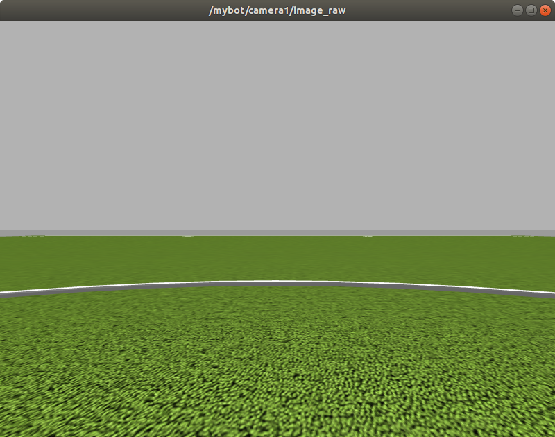

# EyeVehicle
use eye gaze to control the movement of a vehicle in ros

<div align=center></div>

### What's in this repo?
- [x] A robot with camera sensor
- [x] Face detection and analysis
- [x] Eye gaze estimation
- [x] Mouth status estimation
- [x] Control signal rendering to the robot


### Preparation
- Download the eye gaze [models](https://www.dropbox.com/sh/h23x33stlrhqvqq/AADn4iK7NMIc8bVnOkBpBBMSa?dl=0) and extract it to $ROOT_REPO


### Compile
```
cd $ROOT_REPO
catkin_make
echo '$ROOT_REPO/devel/setup.bash' > ~/.bashrc
source ~/.bashrc
```

### Demo

1. Show robot in gazebo simulator
<div align=center></div>

```
cd $ROOT_REPO
# show robot in gazebo
roslaunch mybot_gazebo mybot_world.launch
```

2. Show image obtained by the camera on the robot

<div align=center></div>

```
# show image from the robot camera
rosrun image_view image_view image:=/mybot/camera1/image_raw
```

3. Analyze mouth status and estimate eye gaze to control the robot

   - Eye gaze is to control the moving direction. 
      - look down to move backword
   - Start moving by open your mouth or push space key

```
# use mouth and eyes to send the comand
python script/eye_command_node.py
```

